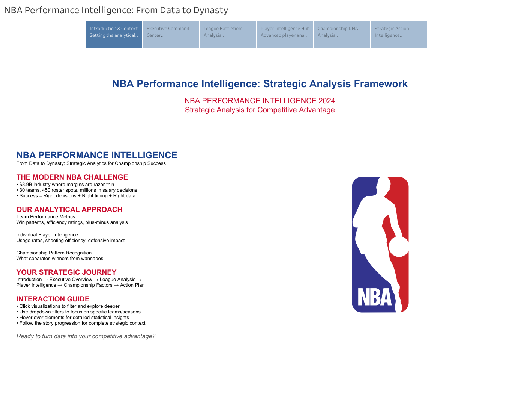
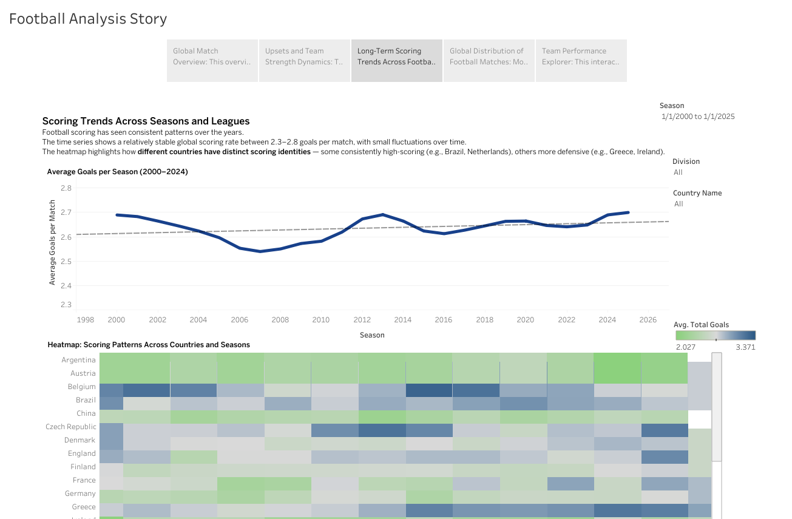

# Nuzaif Naveed

Data Scientist and BI Developer based in Florida. I am finishing my MS in Data Analytics at Canisius University, and most of my work sits somewhere between machine learning, ETL pipelines, and the dashboards that make all of it usable for people who do not want to read a model output.

My background is a bit of a mix, and I think that is my advantage. I spent years in financial planning and analytics before moving fully into data, so I am used to the whole path: pulling data out of messy systems, building the pipeline to clean it, running the models, and then packaging the result into something a portfolio manager or an executive can actually act on. Recently that has meant credit risk modeling at M&T Bank and building automated data flows at Coastal Wealth.

A quick thing I am proud of: I placed 1st in the Canisius Data Olympiad in both 2025 and 2026. It is an international 48-hour competition where you analyze energy data from over 1,600 buildings, build predictive models, and present your findings to a panel of US and Canadian professionals. Winning it twice was not luck.

You can see my full set of dashboards on my [Tableau Public profile](https://public.tableau.com/app/profile/nuzaif.naveed).

## Featured Dashboards

Both of these are live and fully interactive. Click through to explore them on Tableau Public.

### NBA Performance Intelligence: From Data to Dynasty

A Tableau story digging into what actually separates a good NBA team from a championship-level one. It moves through the data as a narrative rather than just throwing charts at you, so you can follow the argument about what builds a dynasty.

[Open the dashboard](https://public.tableau.com/app/profile/nuzaif.naveed/viz/AssignmentPart5/NBAPerformanceIntelligenceFromDatatoDynasty)

### Football Analysis Story

A visual breakdown of football performance and trends, built as an interactive story. The idea was to take a lot of match and player data and turn it into something you can read at a glance while still being able to drill into the detail.

[Open the dashboard](https://public.tableau.com/app/profile/nuzaif.naveed/viz/FinalProjectNuzaif/FootballAnalysisStory)

## Competition Projects

### Canisius Data Olympiad 2026 (1st Place)

My winning entry for the 2026 Olympiad. The challenge was to analyze energy consumption data from more than 1,600 buildings inside 48 hours, build predictive models, and deliver the insights to a professional judging panel. Work is in Python and Jupyter.

[View the repository](https://github.com/BrickOP/Olympiad_2026)

### Canisius Data Olympiad 2025 (1st Place)

My winning entry for the 2025 Olympiad, held April 25 to 27. Same format, same intensity, first place again.

[View the repository](https://github.com/CipherSci/Data_Olympiad_2025_Canisius)

## What I work with

Languages and modeling: Python (pandas, NumPy, scikit-learn, XGBoost, TensorFlow), R, SQL, PySpark

Data engineering: ETL pipelines, Apache Kafka, Hadoop, Databricks, Power Query, data warehousing

Cloud: AWS (S3, RDS, Redshift, Glue, Lambda, EC2)

BI and visualization: Tableau, Power BI, Excel VBA, Matplotlib

Databases: SQL, NoSQL (MongoDB, DocumentDB)

## Education

MS in Data Analytics, Canisius University. GPA 4.0, Dean's List 2026.

## Contact

Tableau Public: https://public.tableau.com/app/profile/nuzaif.naveed

LinkedIn: https://www.linkedin.com/in/YOUR-LINKEDIN-HANDLE/

Email: nuzaifn@gmail.com
